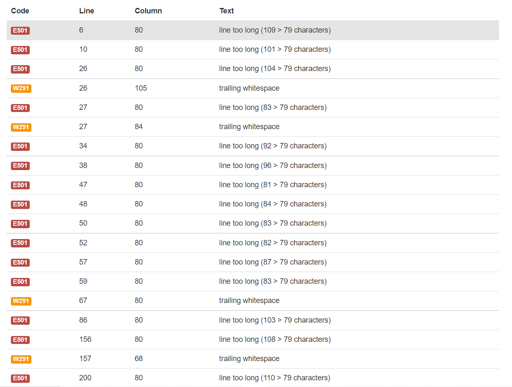

# Battleship--Game
To open this Game in your terminal type: 
' python3 run.py ' 

This battleship game is only played by one user. 
The user wins by eliminating 5 of the computer's ships.
The computer will try and do the same. the computer generates a random number to try and hit one of your ships.

This is a picture of the Heroku website where you will be playing the game.

# How To play
* To start the game, the user enters their name.
   + Two boards are randomly generated. 
   + The board with the user's name is the user's board, The board with Computer written at the top of the board is the computer's board. 
   + You will select a row and column (the computer will do the same), row and column are numbers between 0 and 9. Row and column are used to get the coordinates. 
   + Once either you or the computer hit the opponent's 5 ships, a new game will start and you will be congratulated. 

# Features
* What features does my game have?
   + Random board generator that generates the player and computer ships randomly.
   + the computer ships are hidden from the user.
   

* Inputs
   + Get's user input
   + Play against the computer

* Input validation and error checking
   + You cannot enter a row or column number that's lower than 0 or that's higher than 9.
   + You cannot enter the same guess twice. 

# Data Model
I decided to use a class model to generate the player and computer board and add the other methods to those boards.

The set-up board class stores many variables but the most important are num_ships, player_name, computer_board, computer_board2, and board. They were all used to create and modify the player and computer boards. 

The computer_board2 is used for displaying the computer's board to the user, the other computer_board is used as the backend where the game is actually happening.  

# Testing
I have tested this project myself by:
   + Running this code in PEP8 and confirmed their was no major errors, Theirs only errors for lines being too long, i tried fixing them but couldn't do it, Theirs warnings for trailing white space too.
   + Giving the terminal invalid corordinates, giving both row and column higher than 9 numbers and letters.
   + I have tested my app in the Heroku website too.

   
## Bugs
* Solved Bugs
   + Their was a bug in the make_guess function where the computer will go into a infinit loop whenever it picks the same number twice, i fixed this issue by creating another random number in the else statement so that the computer will always pick a different number. 

* Remaining bugs
   + No remaining bugs
# Deployment
This project was deployed to Heroku with the help of code insitute's deployment video.
Heroku Link - https://battleship--game.herokuapp.com/
* steps for deployment
   + Create a new Heroku app.
   + set Key to PORT and value to 8000 in the Config Vars in settings page.
   + set the buildpacks to python and Node.js in that order in the settings page.
   + press manual deploy in the deploy page in heroku.
# Credits
   + Mentors help and advice
   + Tutors help
   + Code Insitute deployment video.

