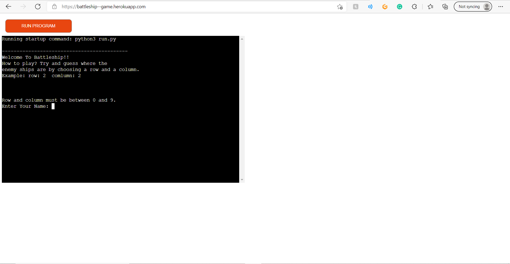

# Battleship--Game
This battleship game is only played by one user. 
The user wins by eliminating 5 of the computers ships.

## How To play
* To start the game, the user enters their name.
   + Two boards are randomly generated. 
   + The board with the user's name is the user's board, The board with Computer written at the top of the board is the computer's board. 
   + You will select a row and column (the computer will do the same), row and column are numbers between 0 and 9. Row and column are used to get the coordinates. 
   + Once either you or the computer hit the opponent's 5 ships, a new game will start and you will be congratulated. 

## Features
* What features does my game have ?
   + Random board generator that generates the player and computer ships randomly.
   + the computer ships are hidden from the user.
   
   + Get's user input
   + Play against the computer
   
* Input validation and error checking
   + You cannot enter a row or column number that's lower than 0 or thats higher than 9.
   + You cannot enter the same guess twice. 
   
   
## Data Model
Heroku Link - https://battleship--game.herokuapp.com/
bob
